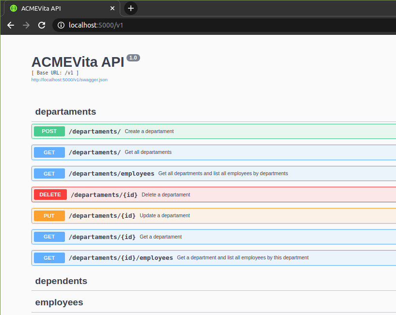

# ACMEVita

API REST desenvolvida com Python 3, Flask e Postgres.

## Estrutura

Projeto baseado no padrão *factory*, arquitetura com *blueprints* e práticas do *Twelve Factor*.

Principais arquivos:

* ```/app/__init__.py```: instancia as configurações e blueprints;

* ```/app/config.py```: configurações da aplicação, determinada por tipo de ambiente;

* ```/app/blueprints/```: endpoints das regras negócios e outros;

* ```/app/extensions/```: instancia e configura extensões de terceiros;

* ```/app/tests/```: testes do projeto;

**Visão geral:**

```
.
├── app
│   ├── blueprints
│   │   ├── business
│   │   │   ├── __init__.py
│   │   │   └── v1
│   │   │       ├── departament
│   │   │       │   ├── __init__.py
│   │   │       │   ├── models.py
│   │   │       │   ├── resources.py
│   │   │       │   ├── schemas.py
│   │   │       │   └── swagger.py
│   │   │       ├── dependent
│   │   │       │   ├── __init__.py
│   │   │       │   ├── models.py
│   │   │       │   ├── resources.py
│   │   │       │   └── schemas.py
│   │   │       ├── employee
│   │   │       │   ├── __init__.py
│   │   │       │   ├── models.py
│   │   │       │   ├── resources.py
│   │   │       │   ├── schemas.py
│   │   │       │   └── swagger.py
│   │   │       └── __init__.py
│   │   ├── common
│   │   │   ├── __init__.py
│   │   │   └── pagination.py
│   │   └── __init__.py
│   ├── extensions
│   │   ├── __init__.py
│   │   ├── cors
│   │   │   └── __init__.py
│   │   ├── database
│   │   │   └── __init__.py
│   │   ├── migrate
│   │   │   └── __init__.py
│   │   └── schema
│   │       └── __init__.py
│   ├── tests
│   │   ├── __init__.py
│   │   ├── test_departament.py
│   │   ├── test_dependent.py
│   │   └── test_employee.py
│   ├── __init__.py
│   ├── config.py
│   └── wsgi.py
├── contrib/
├── docs/
├── scripts/
├── .env
├── docker-compose.yml
├── Dockerfile
├── Makefile
├── README.md
└── requirements.txt
```

A aplicação deve ser executada nos ambientes de *development* ou *production*, via Docker. Para executar sem o Docker, instale o Python 3, as dependências do `requirements.txt`, o Postgres e crie os databases/credenciais de acordo com o `.env`.

## Configurações

Requisitos:

* Git - https://git-scm.com/downloads

* Docker - https://docs.docker.com/engine/install/

* Docker Compose - https://docs.docker.com/compose/install/

Após instalar os requisitos:

1. Clone o repositório: `git clone https://github.com/daltroedu/acmevita.git`
2. Acesse o diretório: `cd acmevita/`
3. Exporte o ambiente de *develompent*: `export FLASK_ENV=development`
4. *Build* os containers: `make build`
    * A primeira build pode demorar
    * A aplicação escuta na porta 5000 e o banco de dados na 5432
5. Execute os containers: `make run`
    * Para executar com logs/stdout: `make run-stdout`
    * Encerrar: `make stop`
    * Esses e outros comandos/atalhos estão disponíveis no arquivo `Makefile`
6. Crie as migrações: `make db-init`
7. Execute: `make db-migrate`
	* `db-migrate` e `db-upgrade` funcionam somente após todas as configurações do Postgres
8. Exporte para o Postgres: `make db-upgrade`
9. Executando os testes: `make run-tests`

## Endpoints

Os endpoints estão divididos por contexto: *departaments*, *employees* e *dependents*, sendo *employees* um recurso pai de *dependents*.

Caso utilize o Postman, no diretório `contrib/` tem as collections para exportação.

A documentação da API (Swagger) pode ser acessada em: `http://localhost:5000/v1`

